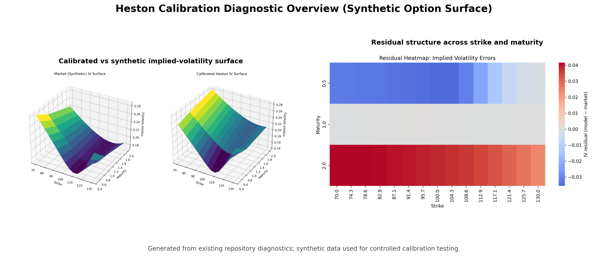
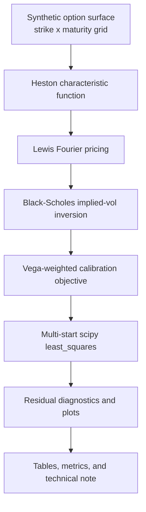
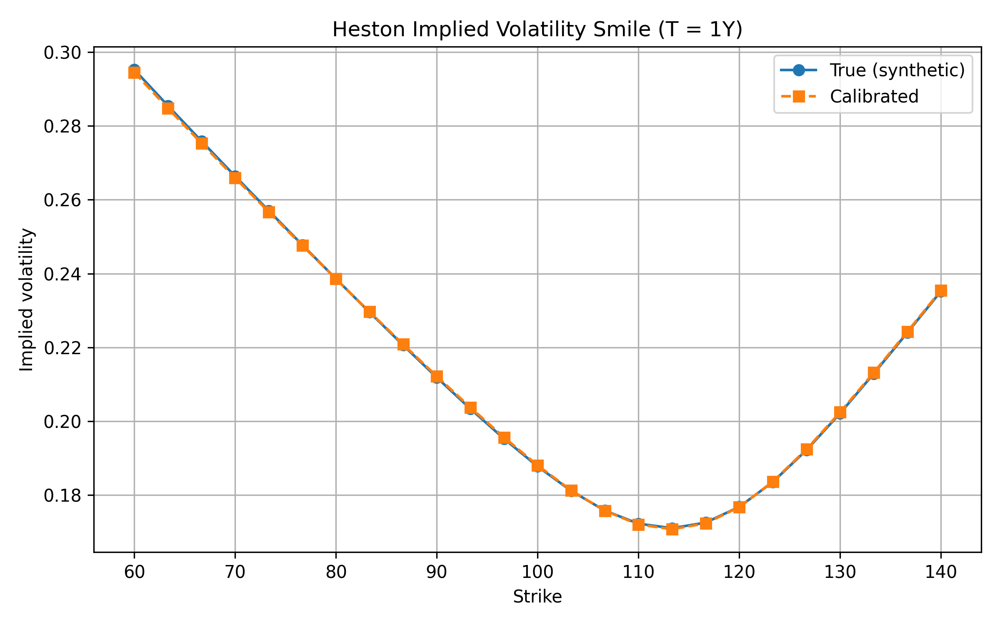
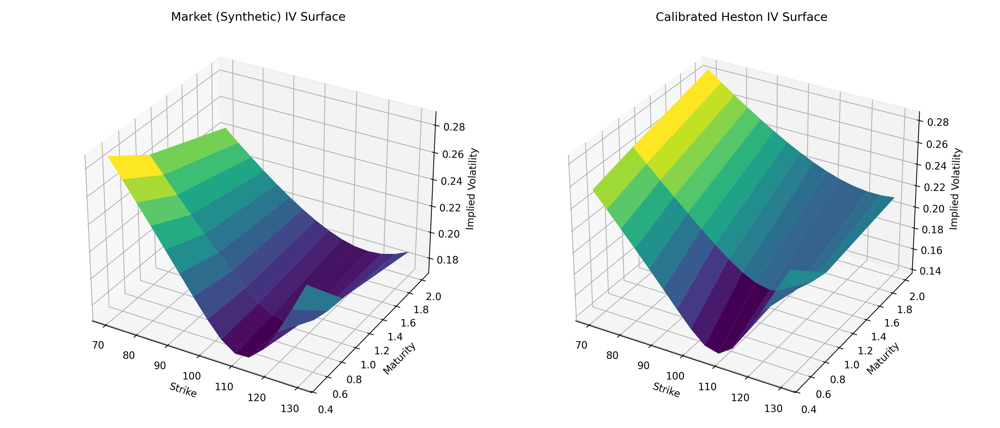
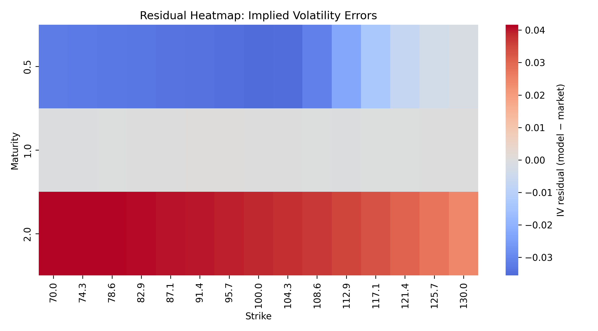
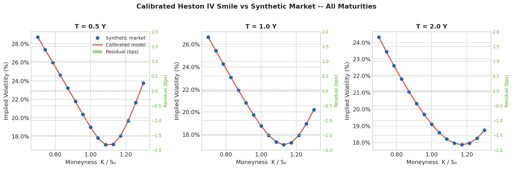
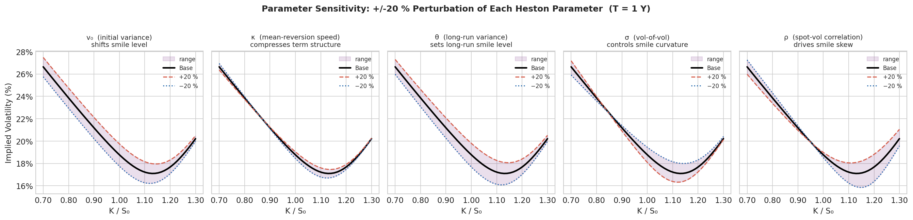
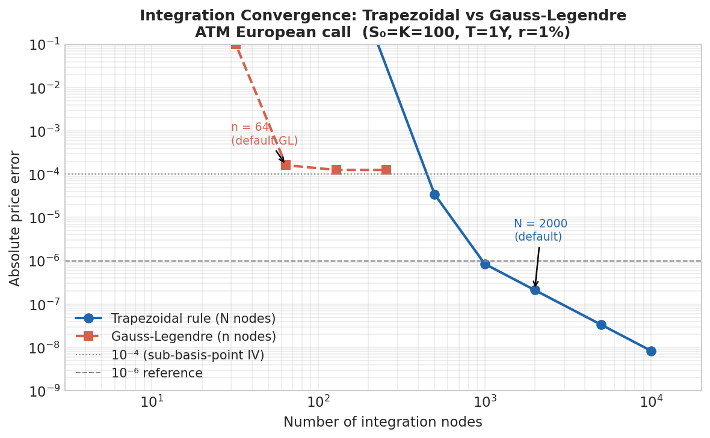
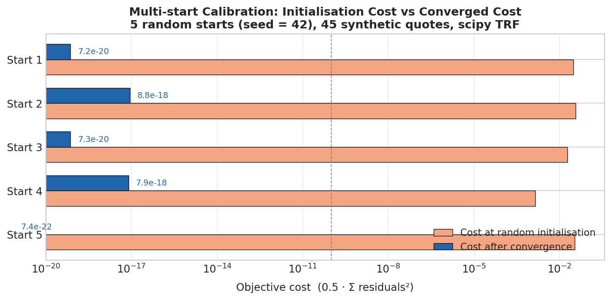

# Heston Model Calibration

> Production-shaped Heston stochastic volatility calibration with Fourier pricing, diagnostics, and robustness checks.

[](https://www.python.org/)
[](LICENSE)
[](tests/)
[](https://docs.scipy.org/doc/scipy/reference/generated/scipy.optimize.least_squares.html)

This repository implements a reproducible Heston calibration workflow for option pricing research. It combines characteristic-function pricing, parameter calibration, diagnostic plots, and robustness checks to make volatility-surface fitting more transparent and auditable.

<p align="center">
  
</p>

> Example diagnostic output from the synthetic calibration experiment, showing the calibrated Heston surface fit and residual structure across the option grid.

*Accompanying technical note:* [Heston Model Calibration Using Numerical Optimisation](<Heston Model Calibration Using Numerical Optimisation.pdf>) - Dr. Muhammad Shoaib.

## At a Glance

| Area | Details |
|---|---|
| Domain | Quantitative finance / option pricing |
| Model | Heston stochastic volatility model |
| Core methods | Fourier pricing, constrained least-squares optimisation, multi-start calibration, diagnostics |
| Outputs | Calibrated parameters, pricing errors, residual heatmaps, smile plots, reproducible reports |
| Intended use | Research/portfolio implementation, not a trading or investment system |

## Problem

Option markets imply a volatility surface that changes across strike and maturity. A constant-volatility Black-Scholes model cannot capture common features such as skew, smile, and term-structure effects. The Heston model introduces stochastic variance, but calibration is numerically delicate: parameters can be weakly identified, objective functions may be unstable, and good diagnostics are essential.

| Challenge | How it is handled here |
|---|---|
| Complex branch cuts in the characteristic function | Gatheral / Little Trap convention with branch enforcement |
| Non-convex, multi-modal objective | Multi-start calibration with reproducible random seeds |
| IV inversion near arbitrage bounds | `scipy.optimize.brentq` with bracket validation |
| Singular or near-singular Jacobian | Trust Region Reflective algorithm with parameter bounds |
| Parameter non-uniqueness | Surface-level diagnostics prioritised over exact parameter recovery |
| Numerical fragility in the calibration loop | NaN-safe objective with penalties for failed IV inversions |

## Solution

This project provides a reproducible workflow for:

- pricing European call options under the Heston model;
- calibrating model parameters to synthetic option-implied volatility surfaces;
- inspecting pricing errors and residual structure;
- checking parameter plausibility, multi-start behaviour, and numerical robustness;
- presenting outputs through plots, tables, tests, and a technical PDF note.

## What This Demonstrates

- Stochastic volatility modelling in Python.
- Fourier/characteristic-function based pricing.
- Numerical optimisation for model calibration.
- Calibration diagnostics and error analysis.
- Reproducible quantitative research project structure.
- Clear communication of model limitations.

## Reviewer Path

For a fast technical review:

- read the minimal calibration script: `examples/run_calibration.py`;
- inspect the pricing kernel: `heston/pricing.py`;
- inspect the calibration logic: `heston/calibration.py`;
- view the diagnostic plots below;
- run `python -m pytest` to check the test suite;
- open the technical note linked near the top for the longer explanation.

## Model Overview

The Heston model specifies joint dynamics for the asset price \(S_t\) and instantaneous variance \(v_t\):

$$
dS_t = r S_t\,dt + \sqrt{v_t} S_t\,dW_t^S
$$

$$
dv_t = \kappa(\theta - v_t)\,dt + \sigma\sqrt{v_t}\,dW_t^v
$$

$$
d\langle W^S, W^v \rangle_t = \rho\,dt
$$

Heston parameter definitions:

| Symbol | Parameter | Meaning |
|---|---|---|
| \(v_0\) | `v0` | Initial variance |
| \(\kappa\) | `kappa` | Mean reversion speed |
| \(\theta\) | `theta` | Long-run variance |
| \(\sigma\) | `sigma` | Volatility of variance |
| \(\rho\) | `rho` | Correlation between asset and variance shocks |

Pricing uses the Lewis (2001) Fourier inversion formula, with the Heston characteristic function evaluated using the Gatheral/"Little Trap" branch convention.

$$
C(S_0, K, T, r) = S_0 - \frac{\sqrt{S_0K}e^{-rT}}{\pi}
\int_0^\infty
\operatorname{Re}\left[
\frac{e^{-iu\log(K/S_0)}\varphi(u - \frac{1}{2}i;T)}
{u^2 + \frac{1}{4}}
\right]du
$$

## Calibration Workflow



## Repository Structure

| Path | Purpose |
| --- | --- |
| `heston/` | Core pricing, characteristic-function, implied-volatility, calibration, and utility code |
| `examples/` | Runnable calibration, synthetic surface, benchmark, figure, and table-generation scripts |
| `tests/` | Pytest suite for pricing, characteristic functions, implied vol, and calibration |
| `tables/` | Generated LaTeX result tables |
| `fig_*.png` | Calibration diagnostics and numerical-analysis figures used in the README |
| `plot_*.py` | Standalone plotting helpers for selected figures |
| `pyproject.toml` | Package metadata and optional development dependencies |
| `requirements.txt` | Requirements-based install path |
| `CITATION.cff` | Citation metadata |
| `Heston Model Calibration Using Numerical Optimisation.pdf` | Accompanying technical note |

## Quickstart

```powershell
git clone https://github.com/drmshoaib/heston-model-calibration.git
cd heston-model-calibration
python -m venv .venv
.\.venv\Scripts\Activate.ps1
pip install -e ".[dev]"
```

Run the minimal reproducible calibration:

```powershell
python examples/run_calibration.py
```

Run the full synthetic surface experiment:

```powershell
python examples/synthetic_smile_experiment.py
```

Run the pricing benchmark and tests:

```powershell
python examples/benchmark_pricing.py
python -m pytest
```

For environments that prefer requirements files, `pip install -r requirements.txt` is also supported.

## Example Outputs

The repository already includes diagnostic plots and generated LaTeX result tables.

| Asset | What to inspect |
| --- | --- |
| `fig_1_heston_smile_T1Y.png` | Single-maturity smile fit |
| `fig_2_market_vs_model_iv_surface.png` | Synthetic surface versus calibrated surface |
| `fig_3_residual_heatmap.png` | Residual structure across strike and maturity |
| `fig_4_smile_all_maturities.png` | Smile fit across all maturities |
| `fig_5_parameter_sensitivity.png` | Parameter sensitivity analysis |
| `fig_6_integration_convergence.png` | Fourier integration convergence |
| `fig_7_multistart_costs.png` | Multi-start optimisation cost landscape |
| `tables/table_true_vs_cal.tex` | True versus calibrated parameters |
| `tables/table_metrics.tex` | Implied-volatility fit metrics |
| `tables/table_multistart.tex` | Multi-start calibration summary |

### 1. Implied Volatility Smile at T = 1Y

The calibrated model reproduces the synthetic implied-volatility smile at T = 1 year across the strike range.



### 2. Full Surface Comparison

Side-by-side comparison of the synthetic ground-truth implied-volatility surface and the calibrated model surface.



### 3. Residual Heatmap

Residual implied volatilities show whether the calibration error has systematic structure across the strike-maturity grid.



### 4. All-Maturity Smile Fit

The same five-parameter model is fitted across T = 0.5Y, T = 1.0Y, and T = 2.0Y.



### 5. Parameter Sensitivity

This figure perturbs each Heston parameter while holding the others fixed, showing how smile level, skew, and curvature respond.



### 6. Integration Convergence

The convergence plot compares numerical integration error as the quadrature resolution changes.



### 7. Multi-Start Cost Landscape

The multi-start plot shows the drop from random initial costs to converged objective values.



## Key Results

The main experiment uses a noiseless synthetic implied-volatility surface generated from known Heston parameters. This is useful for testing numerical behaviour independently of market microstructure noise.

| Item | Value |
|---|---|
| Spot | 100 |
| Rate | 1% |
| Strike grid | 70 to 130, 15 strikes |
| Maturity grid | 0.5Y, 1.0Y, 2.0Y |
| Surface size | 45 option quotes |
| Multi-start seed | 42 |
| Starts | 5 |

### Ground-Truth Parameters

| Parameter | Symbol | True value |
|---|---|---:|
| Initial variance | \(v_0\) | 0.0400 |
| Mean reversion speed | \(\kappa\) | 1.5000 |
| Long-run variance | \(\theta\) | 0.0400 |
| Volatility of variance | \(\sigma\) | 0.5000 |
| Correlation | \(\rho\) | -0.7000 |

### Parameter Recovery

| Parameter | True | Calibrated | Absolute diff |
|---|---:|---:|---:|
| `v0` | 0.0400 | 0.0399 | 1.0e-04 |
| `kappa` | 1.5000 | 1.4989 | 1.1e-03 |
| `theta` | 0.0400 | 0.0401 | 1.0e-04 |
| `sigma` | 0.5000 | 0.5001 | 1.0e-04 |
| `rho` | -0.7000 | -0.7000 | < 1e-04 |

Parameter recovery this close to ground truth is expected only in a noiseless synthetic setting. With real option data, the Heston model can be weakly identified, so residual structure and surface-level fit matter more than exact parameter recovery.

### Implied Volatility Fit Metrics

| Metric | Value |
|---|---:|
| IV RMSE | 9.3e-08 |
| IV MAE | < 1e-07 |
| Max absolute IV error | < 1e-06 |

These errors are at numerical-integration scale for the synthetic experiment, not evidence of market-data performance.

### Calibration Diagnostics

| Quantity | Value |
|---|---|
| Optimisation algorithm | scipy TRF / `scipy.optimize.least_squares` |
| Function evaluations to convergence | 7 |
| Final cost | 3.6e-17 |
| Feller condition | Mildly violated in the synthetic parameter set; surface fit remains accurate |

## Technical Credibility

| Area | Evidence in this repository |
| --- | --- |
| Characteristic function | Gatheral/"Little Trap" branch convention in `heston/cf.py` |
| Pricing | Lewis (2001) Fourier pricing with scalar and vectorised strike support |
| Implied volatility | Black-Scholes inversion using Brent root finding |
| Calibration | Vega-weighted residual objective and bounded `scipy.optimize.least_squares` |
| Robustness | Multi-start calibration with reproducible seeds |
| Diagnostics | Surface plots, residual heatmap, sensitivity analysis, convergence study |
| Testing | Pytest coverage for characteristic functions, pricing, implied vol, and calibration |
| Reproducibility | Example scripts, generated tables, technical note, and citation metadata |

## Performance Notes

The pricing function accepts scalar or one-dimensional strike arrays. When called with an array, the characteristic function is evaluated once per maturity and the Lewis integrand is broadcast across strikes.

| Method | Mean time | Notes |
| --- | ---: | --- |
| Scalar loop, 200 per-strike calls | ~630 ms | Original approach |
| Vectorised, 200 strikes in one call | ~77 ms | About 8.2x faster |

Runtime in calibration is dominated by implied-volatility inversion for each quote and objective evaluation.

## Limitations

- This is a research/portfolio implementation, not a production trading system.
- Calibration quality depends on data quality, initial guesses, objective choice, and numerical settings.
- Heston parameters may be weakly identified for sparse, noisy, or realistic option surfaces.
- Results should be interpreted as model diagnostics and research outputs, not trading advice.
- The main experiments use synthetic, noiseless data rather than live market option chains.
- The implementation assumes a flat interest rate and does not model dividends or term structures.

## Portfolio Signal

This project demonstrates:

- mathematical finance implementation;
- numerical optimisation;
- stochastic volatility modelling;
- pricing-model diagnostics;
- production-shaped Python project presentation;
- clear communication of assumptions and limitations.

## Suggested Next Improvements

| Extension | Benefit |
| --- | --- |
| Bid-ask weighted calibration | Treats market quotes as noisy observations rather than exact targets |
| Market data ingestion | Enables real option-chain experiments |
| Term structures and dividends | Improves realism for equity/index option calibration |
| Global optimisation comparison | Benchmarks multi-start against differential evolution or similar methods |
| Additional model comparisons | Places Heston beside SABR, Bates, or rough-volatility alternatives |
| Report artifact generation | Produces a single client-facing calibration report from each run |

## GitHub Topics

Suggested repository topics for discoverability:

`heston-model` | `stochastic-volatility` | `option-pricing` | `quantitative-finance` | `model-calibration` | `numerical-optimization` | `fourier-pricing` | `derivatives-pricing` | `python`

## Citation

If you use this code or framework in academic or professional work, please cite:

```bibtex
@software{shoaib2025heston,
  author  = {Shoaib, Muhammad},
  title   = {Heston Model Calibration Using Numerical Optimisation},
  year    = {2025},
  url     = {https://github.com/drmshoaib/heston-model-calibration},
  license = {MIT}
}
```

A `CITATION.cff` file is also provided for automated citation tooling.

## Contact

**Dr. Muhammad Shoaib**

Email: safridi@gmail.com

GitHub: [@drmshoaib](https://github.com/drmshoaib)

For technical discussion of the model, calibration methodology, or numerical implementation, feel free to open an issue or get in touch directly.

## License

MIT.
