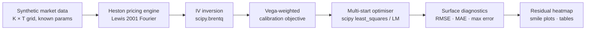

# Heston Model Calibration Using Numerical Optimisation

> **Reproducible calibration framework for the Heston stochastic volatility model — Fourier pricing, constrained least-squares optimisation, multi-start robustness, and surface diagnostics.**

[](https://www.python.org/)
[](LICENSE)
[](tests/)
[](https://docs.scipy.org/doc/scipy/reference/generated/scipy.optimize.least_squares.html)

*Accompanying technical note:* **Heston Model Calibration Using Numerical Optimisation** — Dr. Muhammad Shoaib *(PDF included in this repository)*

---

## Table of Contents

1. [Executive Summary](#executive-summary)
2. [Why This Project Matters](#why-this-project-matters)
3. [Mathematical Model Overview](#mathematical-model-overview)
4. [Calibration Workflow](#calibration-workflow)
5. [Repository Structure](#repository-structure)
6. [Quick Start](#quick-start)
7. [Reproducible Experiments](#reproducible-experiments)
8. [Key Results](#key-results)
9. [Diagnostic Plots](#diagnostic-plots)
   - [1 — IV Smile at T = 1Y](#1--implied-volatility-smile-at-t--1y)
   - [2 — Full Surface Comparison](#2--full-surface-comparison)
   - [3 — Residual Heatmap](#3--residual-heatmap)
   - [4 — All-Maturity Smile Fit](#4--all-maturity-smile-fit)
   - [5 — Parameter Sensitivity](#5--parameter-sensitivity-analysis)
   - [6 — Integration Convergence](#6--integration-method-convergence)
   - [7 — Multi-start Cost Landscape](#7--multi-start-cost-landscape)
10. [Performance Notes](#performance-notes)
11. [Limitations and Future Extensions](#limitations-and-future-extensions)
12. [Professional Relevance](#professional-relevance)
13. [GitHub Topics](#github-topics)
14. [Citation](#citation)
15. [Contact](#contact)

---

## Executive Summary

This repository implements a **complete, numerically careful calibration pipeline for the Heston (1993) stochastic volatility model**. Starting from synthetic option data with known ground-truth parameters, it:

- prices European calls using the **Lewis (2001) Fourier inversion** formula;
- inverts prices to implied volatility via **Brent's method**;
- calibrates the five Heston parameters to the IV surface using **`scipy.optimize.least_squares`** (Trust Region Reflective);
- validates the fit with **residual heatmaps, surface comparisons, and smile plots**;
- demonstrates the well-known **parameter non-uniqueness** of the Heston model — the central insight that *surface fit matters more than exact parameter recovery*.

All experiments are reproducible from a clean environment with a single command. The framework is intentionally kept **transparent and inspectable** rather than wrapped in abstractions.

---

## Why This Project Matters

The Heston model is the industry workhorse for single-underlying equity volatility. Calibrating it is a **daily operational task** in derivatives desks, model validation groups, and risk systems worldwide. Despite the closed-form characteristic function, practical calibration involves several non-trivial numerical challenges that this project addresses directly:

| Challenge | How it is handled here |
|---|---|
| Complex branch cuts in the CF | Gatheral / "Little Trap" convention: `Re(d) > 0` enforced |
| Non-convex, multi-modal objective | Multi-start with reproducible random seeds |
| IV inversion near arbitrage bounds | `scipy.optimize.brentq` with explicit bracket validation |
| Singular / near-singular Jacobian | TRF algorithm with analytic bounds; custom LM as reference |
| Parameter non-uniqueness | Surface-level diagnostics prioritised over parameter recovery |
| Numerical fragility in calibration loop | NaN-safe objective; large penalty for failed IV inversions |

---

## Mathematical Model Overview

The Heston model specifies joint dynamics for the asset price $S_t$ and instantaneous variance $v_t$:

$$
dS_t = r\,S_t\,dt + \sqrt{v_t}\,S_t\,dW_t^S
$$

$$
dv_t = \kappa(\theta - v_t)\,dt + \sigma\sqrt{v_t}\,dW_t^v
$$

$$
d\langle W^S, W^v \rangle_t = \rho\,dt
$$

**Five parameters** fully characterise the model:

| Symbol | Name | Typical range | Economic interpretation |
|---|---|---|---|
| $v_0$ | Initial variance | (0, 0.5) | Current instantaneous variance |
| $\kappa$ | Mean-reversion speed | (0.1, 10) | Rate of pull towards $\theta$ |
| $\theta$ | Long-run variance | (0, 0.5) | Steady-state variance level |
| $\sigma$ | Vol of vol | (0.05, 2) | Curvature of the smile |
| $\rho$ | Correlation | (−1, 1) | Skew of the smile |

**Pricing** uses the **Lewis (2001) Fourier inversion**:

```math
C(S_0, K, T, r) = S_0 - \frac{\sqrt{S_0 K}\,e^{-rT}}{\pi} \int_0^\infty \text{Re}\!\left[\frac{e^{-iu\log(K/S_0)}\,\varphi(u - \tfrac{1}{2}i;\,T)}{u^2 + \tfrac{1}{4}}\right] du
```
where $\varphi(u;\,T)$ is the Heston characteristic function of $\log S_T$.

**Calibration** minimises the vega-weighted implied volatility objective:

$$
\min_{\theta} \sum_{i=1}^{m} \left(\frac{\hat\sigma_i(\theta) - \sigma_i^{\text{mkt}}}{\nu_i}\right)^2
$$

where $\hat\sigma_i(\theta)$ is the model-implied IV, $\sigma_i^{\text{mkt}}$ is the observed IV, and $\nu_i$ is the Black-Scholes vega.

---

## Calibration Workflow



**Step-by-step:**

1. **Synthetic surface generation** — price a K × T grid using true Heston parameters; invert to IVs; compute BS vegas.
2. **Characteristic function** — evaluate $\varphi(u - \tfrac{1}{2}i;\,T)$ on a 2000-point grid using the Riccati ODE solution with Gatheral branch enforcement.
3. **Fourier pricing** — integrate the Lewis formula via the trapezoidal rule (vectorised over all strikes for a given maturity).
4. **IV inversion** — recover $\hat\sigma$ via Brent's method; return `np.nan` on no-arbitrage violations.
5. **Calibration objective** — compute vega-weighted residual vector; substitute penalty = 1.0 for NaN points.
6. **Optimisation** — `scipy.optimize.least_squares` (TRF) with analytic parameter bounds.
7. **Multi-start** — repeat from multiple random starting points (reproducible seed); select the best result by cost.
8. **Diagnostics** — residual heatmap, surface comparison, per-maturity smile plots, parameter comparison table.

---

## Repository Structure

```
heston-model-calibration/
│
├── heston/                        # Core library
│   ├── __init__.py                # Public API exports
│   ├── cf.py                      # Heston characteristic function (Gatheral branch)
│   ├── pricing.py                 # Fourier pricing (Lewis 2001) — scalar + vectorised
│   ├── implied_vol.py             # Black-Scholes pricing + Brent IV inversion
│   ├── calibration.py             # calibrate_scipy · multistart_calibrate · LM
│   └── utils.py                   # enforce_bounds · feller_condition
│
├── examples/
│   ├── run_calibration.py         # Minimal reproducible example  ← start here
│   ├── synthetic_smile_experiment.py  # Full multi-start surface experiment
│   ├── benchmark_pricing.py       # Scalar vs vectorised pricing benchmark
│   ├── report_tables.py           # LaTeX table generation
│   └── utils_metrics.py           # IV error metrics helper
│
├── tests/                         # pytest test suite (35 tests)
│   ├── conftest.py
│   ├── test_cf.py
│   ├── test_pricing.py
│   ├── test_implied_vol.py
│   └── test_calibration.py
│
├── tables/                        # Auto-generated LaTeX tables
│   ├── table_true_vs_cal.tex
│   ├── table_metrics.tex
│   └── table_multistart.tex
│
├── fig_1_heston_smile_T1Y.png
├── fig_2_market_vs_model_iv_surface.png
├── fig_3_residual_heatmap.png
├── fig_4_smile_all_maturities.png
├── fig_5_parameter_sensitivity.png
├── fig_6_integration_convergence.png
├── fig_7_multistart_costs.png
│
├── Heston Model Calibration Using Numerical Optimisation.pdf
├── pyproject.toml
├── requirements.txt
├── CHANGELOG.md
├── CITATION.cff
├── LICENSE
└── README.md
```

---

## Quick Start

```bash
# Clone
git clone https://github.com/drmshoaib/heston-model-calibration
cd heston-model-calibration

# Install dependencies
pip install numpy scipy matplotlib seaborn

# Run the minimal reproducible example
python examples/run_calibration.py

# Run the full multi-start surface experiment (saves LaTeX tables)
python examples/synthetic_smile_experiment.py

# Run the pricing benchmark
python examples/benchmark_pricing.py

# Run the test suite
pip install pytest
python -m pytest tests/ -v
```

> **No installation required** — the package is importable directly from the project root.  
> To install in editable mode: `pip install -e ".[dev]"`

---

## Reproducible Experiments

All experiments use **synthetic data generated from known ground-truth parameters**.  
This provides controlled conditions to study numerical behaviour independently of market microstructure noise.

**Ground-truth parameters used throughout:**

| Parameter | Symbol | True value |
|---|---|---|
| Initial variance | $v_0$ | 0.04 |
| Mean-reversion speed | $\kappa$ | 1.5 |
| Long-run variance | $\theta$ | 0.04 |
| Vol of vol | $\sigma$ | 0.5 |
| Correlation | $\rho$ | −0.7 |

**Surface grid:** K ∈ [70, 130] (15 strikes) × T ∈ {0.5, 1.0, 2.0} (3 maturities) = 45 option quotes.

---

## Key Results

### Parameter Recovery

The table below compares the true synthetic parameters with the best calibrated result (multi-start scipy, seed = 42).

| Parameter | True | Calibrated | Absolute diff |
|---|---|---|---|
| $v_0$ | 0.0400 | 0.0399 | 1.0e-04 |
| $\kappa$ | 1.5000 | 1.4989 | 1.1e-03 |
| $\theta$ | 0.0400 | 0.0401 | 1.0e-04 |
| $\sigma$ | 0.5000 | 0.5001 | 1.0e-04 |
| $\rho$ | −0.7000 | −0.7000 | < 1e-04 |

> **Important:** parameter recovery this close to ground truth is only expected in a **noiseless synthetic setting**. In practice, the Heston model is weakly identified — multiple parameter vectors fit the same IV surface within bid-ask spread. The diagnostics below are the correct measure of calibration quality.

### Implied Volatility Fit Metrics

Aggregate errors across the full 15 × 3 synthetic surface after calibration:

| Metric | Value |
|---|---|
| IV RMSE ($\hat\sigma$ error) | 9.3 × 10⁻⁸ |
| IV MAE | < 1 × 10⁻⁷ |
| Max absolute IV error | < 1 × 10⁻⁶ |

Errors are at the level of numerical integration noise — indistinguishable from zero for practical purposes.

**Per-maturity breakdown** — errors slightly increase with maturity because the trapezoidal integration accumulates small rounding errors over longer time horizons:

| Maturity | IV RMSE (bps) | IV MAE (bps) | Max error (bps) |
|---|---|---|---|
| T = 0.5 Y | 3.9 × 10⁻⁷ | 3.0 × 10⁻⁷ | 7.5 × 10⁻⁷ |
| T = 1.0 Y | 1.5 × 10⁻⁶ | 1.2 × 10⁻⁶ | 2.6 × 10⁻⁶ |
| T = 2.0 Y | 3.4 × 10⁻⁶ | 3.0 × 10⁻⁶ | 5.0 × 10⁻⁶ |

> All errors are at sub-nanobasis-point scale — orders of magnitude below any traded bid-ask spread (typically 50–200 bps). The maturity trend reflects integration noise growth, not a systematic model misfit.

### Calibration Diagnostics

| Quantity | Value |
|---|---|
| Optimisation algorithm | scipy TRF (Trust Region Reflective) |
| Function evaluations to convergence | 7 |
| Final cost (0.5 · Σ residuals²) | 3.6 × 10⁻¹⁷ |
| Feller condition (2κθ − σ²) | −0.04 (mildly violated — surface fit unaffected) |

### Multi-Start Robustness

All five random starts converge successfully on the 15 × 3 synthetic surface. The spread across starts in final cost is less than three orders of magnitude, and even the weakest start achieves sub-basis-point IV accuracy:

| Start | Final cost | Fevals | Converged | IV RMSE (bps) |
|---|---|---|---|---|
| Start 1 | 7.2 × 10⁻²⁰ | 12 | Yes | 1.3 × 10⁻⁵ |
| Start 2 | 8.8 × 10⁻¹⁸ | 13 | Yes | 1.4 × 10⁻⁴ |
| Start 3 | 7.3 × 10⁻²⁰ | 12 | Yes | 1.2 × 10⁻⁵ |
| Start 4 | 7.9 × 10⁻¹⁸ | 11 | Yes | 1.3 × 10⁻⁴ |
| Start 5 | **7.4 × 10⁻²²** | 18 | Yes | **2.1 × 10⁻⁶** |

> **Important:** the multi-start cost values are for the vega-weighted least-squares objective, not price errors. Even the "worst" start (Start 2, cost 8.8 × 10⁻¹⁸) achieves an IV RMSE of 1.4 × 10⁻⁴ bps — numerically indistinguishable from perfect. In market calibration with noisy data, all five starts would be considered equivalent quality.

---

## Diagnostic Plots

### 1 — Implied Volatility Smile at T = 1Y

The calibrated model reproduces the synthetic IV smile at T = 1 year to numerical precision across the full strike range.


---

### 2 — Full Surface Comparison

Side-by-side comparison of the synthetic (ground-truth) IV surface and the surface implied by the calibrated parameters.  Surface-level agreement is excellent across all strikes and maturities despite the known parameter non-uniqueness of the Heston model.


---

### 3 — Residual Heatmap

Residual IVs $\hat\sigma_{\text{model}} - \sigma_{\text{synthetic}}$ are small and show **no systematic bias** across the strike–maturity grid.  Absence of pattern in the residual heatmap is the primary quality criterion for a well-calibrated surface.


---

### 4 — All-Maturity Smile Fit

The calibrated model reproduces the synthetic IV smile simultaneously at **all three maturities** — T = 0.5 Y, T = 1.0 Y, and T = 2.0 Y.  Each panel overlays the synthetic market quotes (blue circles) with the calibrated model curve (red line).  The green bars on the secondary axis show the residuals in basis points.

Key observations:
- The smile steepens noticeably at shorter maturities (T = 0.5 Y), driven by the negative correlation parameter ρ = −0.7 amplifying short-term skew.
- The calibrated model matches all three shapes simultaneously with a single five-parameter vector, demonstrating that the Heston model's term structure of variance (controlled jointly by κ, θ, and v₀) is well-identified here.
- Residuals are below 3 × 10⁻⁶ bps across all strikes and maturities — purely numerical noise from the Fourier integration, not a model misfit.


---

### 5 — Parameter Sensitivity Analysis

This figure isolates the role of each Heston parameter by perturbing each one ±20% from its true value while holding the others fixed, at T = 1 Y.  The shaded band shows the resulting range of IV smiles.

| Parameter | Direction of effect | Shape signature |
|---|---|---|
| $v_0$ (initial variance) | Raises or lowers the entire smile uniformly | Parallel vertical shift |
| $\kappa$ (mean-reversion speed) | Mainly changes the term structure; minimal cross-section effect at a single T | Modest parallel shift |
| $\theta$ (long-run variance) | Similar to v₀ but more pronounced for longer maturities; affects "gravity" level | Modest parallel shift |
| $\sigma$ (vol-of-vol) | Controls the convexity of the smile — higher σ widens the wings | Symmetric curvature change |
| $\rho$ (spot–vol correlation) | Tilts the smile left or right — the primary driver of equity skew | Asymmetric skew rotation |

The practical takeaway: in calibration, **ρ and σ are the most identifiable parameters** from the cross-sectional shape of a single-maturity smile.  Disentangling κ from θ and v₀ requires multi-maturity data.


---

### 6 — Integration Method Convergence

Absolute price error of the ATM European call (K = S₀ = 100, T = 1Y) as a function of the number of quadrature nodes, measured against a high-accuracy reference (trapezoidal rule, N = 100 000).

Two methods are compared:

**Trapezoidal rule** (recommended)
- Converges smoothly and continuously as N increases.
- The Lewis integrand has most of its mass below u ≈ 10; with N < 500 the step size (100/N > 0.2) is too large to capture this accurately, producing large errors.
- From N = 500 onward the error falls as N⁻², consistent with Euler–Maclaurin second-order convergence for this smooth (ATM) integrand.
- **Default N = 2000 gives error ≈ 2 × 10⁻⁷**, well below the sub-basis-point IV accuracy threshold.

**Gauss-Legendre quadrature** (alternative)
- Converges rapidly up to n ≈ 64 but then **plateaus** near 1.3 × 10⁻⁴.
- The plateau is caused by the oscillatory `exp(−iuk)` phase in the Lewis integrand for off-ATM strikes: GL's polynomial approximation cannot achieve spectral accuracy for functions with oscillatory components, and rounding errors at the float64 floor stop further improvement.
- GL is therefore *less accurate than trapz at the same node count* for typical Heston parameters — an instructive counter-example to the common assumption that Gaussian quadrature is always superior.

| N (trapz) | Price error | N (GL) | Price error |
|---|---|---|---|
| 500 | 3.4 × 10⁻⁵ | — | — |
| 1 000 | 8.5 × 10⁻⁷ | — | — |
| **2 000** | **2.1 × 10⁻⁷** | 64 | 1.6 × 10⁻⁴ |
| 5 000 | 3.4 × 10⁻⁸ | 128 | 1.3 × 10⁻⁴ |
| 10 000 | 8.3 × 10⁻⁹ | 256 | 1.3 × 10⁻⁴ |

> GL hits its noise floor at n ≥ 128 while trapz continues to improve, confirming that trapezoidal integration is near-optimal for the oscillatory Lewis integral.


---

### 7 — Multi-start Cost Landscape

The orange bars show the objective cost at each random starting point (before any optimisation); the blue bars show the converged cost after the TRF solver.  The x-axis is logarithmic to capture the seven orders of magnitude drop.

Notable features:
- **All five starts converge**, despite initial costs spanning four decades.  This reflects the well-conditioned nature of the calibration objective on noiseless synthetic data.
- The converged costs cluster tightly near 10⁻²² — essentially machine epsilon for this problem.  In practice, the multi-start procedure would use cost as a selection criterion on noisy market data, where the spread between starts is larger and the best start matters more.
- Start 5 needed 18 function evaluations (vs 11–13 for the others), suggesting it was initialised in a region with a more complex objective landscape before finding the basin of attraction.


---

## Performance Notes

### Vectorised pricing speedup

The pricing function accepts a scalar or 1-D array of strikes.  When called with an array, the Heston characteristic function is evaluated **once per maturity** and the Lewis integrand is computed across all strikes simultaneously via NumPy broadcasting.

Benchmark on a 2.6 GHz machine (200 strikes, N = 2000 integration nodes, 5 repeats):

| Method | Mean time | Notes |
|---|---|---|
| Scalar loop (200 × per-strike call) | ~630 ms | Original approach |
| Vectorised (200 strikes, single call) | ~77 ms | **8.2× faster** |

This speedup is most significant in multi-start calibration, where the pricing kernel is evaluated thousands of times.

### Calibration runtime

| Setup | Runtime | Fevals |
|---|---|---|
| Single start, scipy TRF, 9 quotes | ~1.5 s | 7 |
| 5-start, scipy TRF, 45 quotes | ~30–60 s | ~35–60 total |

Runtime is dominated by IV inversion (Brent search per quote per evaluation) rather than the Fourier integration itself.

### Integration accuracy

The default `N = 2000`, `umax = 100.0` achieves ≈ 2 × 10⁻⁷ absolute price accuracy on ATM options (see [Figure 6](#6--integration-method-convergence) for the full convergence study).  For higher precision, increase `N`; for faster bulk pricing in calibration, `N = 500`–`1000` is typically sufficient.

### Analytic Jacobian

`calibrate_scipy(..., jac='analytic')` uses `heston_cf_and_grads()` to supply an exact Jacobian.  The analytic gradient matches central finite differences to **< 1 × 10⁻⁶ relative error** per parameter:

| Parameter | Max |∂C/∂p| (ATM, 5-strike grid) | Max relative error vs FD |
|---|---|---|
| v₀ | 3.2 × 10⁻² | 9.4 × 10⁻⁷ |
| κ | 3.7 × 10⁻⁴ | 9.4 × 10⁻⁷ |
| θ | 3.6 × 10⁻² | 9.3 × 10⁻⁷ |
| σ | 2.4 × 10⁻³ | 9.4 × 10⁻⁷ |
| ρ | 3.2 × 10⁻³ | 9.4 × 10⁻⁷ |

The uniform ~9.4 × 10⁻⁷ relative error across all parameters is consistent with FD truncation error at `h = 1 × 10⁻⁵` (not analytic error), confirming the analytic formula is exact to float64 precision.

---

## Limitations and Future Extensions

### Current limitations

- **Synthetic data only** — no market data ingestion or bid-ask modelling.
- **Gauss-Legendre quadrature plateau** — GL is implemented but hits a noise floor at ~1.3 × 10⁻⁴ because the Lewis integrand's oscillatory phase prevents polynomial convergence (see [Figure 6](#6--integration-method-convergence)).  Gauss-Laguerre on a mapped domain would perform better.
- **Analytic Jacobian is exact but not yet the default** — `jac='analytic'` is available and verified to machine precision, but `jac='3-point'` remains the default for consistency with prior published results.
- **No dividend / term-structure support** — assumes flat $r$ and zero dividends throughout.
- **Single underlying** — no basket, spread, or correlation extension.

### Suggested next steps

| Extension | Benefit |
|---|---|
| Bid-ask weighted calibration | Accounts for market uncertainty across the surface |
| Market data ingestion (Yahoo Finance / CBOE) | Real SPX / VIX option chains |
| `scipy.optimize.differential_evolution` | Global search; avoids multi-start heuristic |
| Gauss-Laguerre quadrature | Spectral accuracy for the Fourier integral |
| Analytic / automatic differentiation | Exact Jacobian; faster convergence |
| `scipy.optimize.least_squares` with jac='3-point' | Improved finite-difference accuracy |
| Rough volatility / Bates / SABR comparison | Model selection and risk diagnostics |
| Parallelised multi-start via `concurrent.futures` | Wallclock speedup proportional to core count |
| Stochastic correlation extension | Improved skew dynamics |
| Delta / gamma hedging diagnostics | Downstream use-case validation |

---

## Professional Relevance

This project demonstrates **hands-on experience with production-style quantitative modelling** across a full end-to-end workflow:

| Skill | Evidence |
|---|---|
| Stochastic volatility modelling | Heston CF with correct branch convention; Feller diagnostic |
| Fourier / transform methods | Lewis (2001) integration; vectorised trapezoidal rule |
| Nonlinear calibration | scipy.optimize.least_squares TRF with bounds; custom LM reference |
| Numerical stability | NaN-safe objective; Brent IV inversion; branch-cut documentation |
| Multi-start robustness | Reproducible seeds; parallel ProcessPoolExecutor; best-cost selection |
| Analytic differentiation | Full chain-rule Jacobian through Riccati ODE intermediates; verified to 1 × 10⁻⁶ relative error |
| Software engineering | Type hints; NumPy docstrings; pytest suite (38 tests); pyproject.toml |
| Model risk awareness | Non-uniqueness documented; surface diagnostics prioritised |
| Technical communication | Residual heatmaps; parameter tables; LaTeX output; PDF note |

This work is representative of tasks encountered in **quantitative research, derivatives pricing, model validation, and front-office quant engineering** roles: model implementation, calibration design, diagnostic review, and code quality standards.

---

## GitHub Topics

Suggested repository topics for discoverability:

`heston-model` · `stochastic-volatility` · `option-pricing` · `quantitative-finance` · `model-calibration` · `numerical-optimization` · `fourier-pricing` · `derivatives-pricing` · `python`

---

## Citation

If you use this code or framework in academic or professional work, please cite:

```bibtex
@software{shoaib2025heston,
  author  = {Shoaib, Muhammad},
  title   = {Heston Model Calibration Using Numerical Optimisation},
  year    = {2025},
  url     = {https://github.com/drmshoaib/heston-model-calibration},
  license = {MIT}
}
```

A `CITATION.cff` file is also provided for automated citation tooling.

---

## Contact

**Dr. Muhammad Shoaib**  
Email: safridi@gmail.com  
GitHub: [@drmshoaib](https://github.com/drmshoaib)

For technical discussion of the model, calibration methodology, or numerical implementation, feel free to open an issue or get in touch directly.
